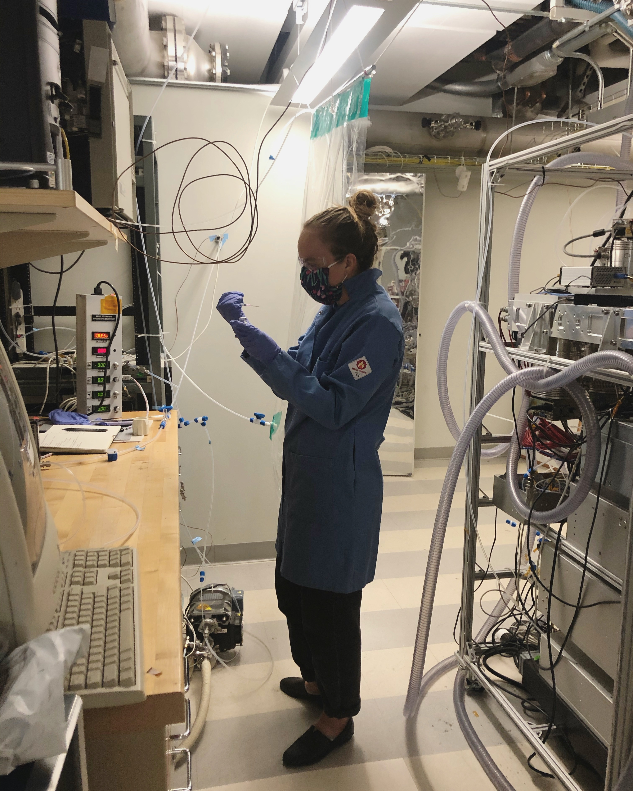

## Laboratory Studies of Peroxy Radical Self-Reaction Kinetics  
 
In this work, I aim to measure the kinetics of peroxy radical self-reactions, sspecifically the pathway to the formation of a peroxide accretion product (ROOR). Using CF$_3$O$^-$ GC-CIMS, I aim to both quantify the formation of the ROOR and also identify these products by comparison against standards synthesized in the lab of Brian Stoltz at Caltech. Thus far, this work has focused on developing a method for the study of these reactions using ethene as a model system. Currently, I am working on expanding this method to study more complex small alkenes and develop a better understanding for the structure-activity relationship of the formation of this product. 

  

## Laboratory and Field Studies of Alkyl Nitrate Formation from Small Alkenes 

In 2021, I participated in the Re-Evaluating the Chemistry of Air Pollutants inCalifornia (RECAP-CA) field campaign, deploying the GC-CIMS in Pasadena to gain a better understanding of the air quality in Southern California. With this data, and comparison to light and dark oxidation experiments in the lab, we are working on identifying the major nitrate compounds in the Los Angeles urban atmosphere. 

 

