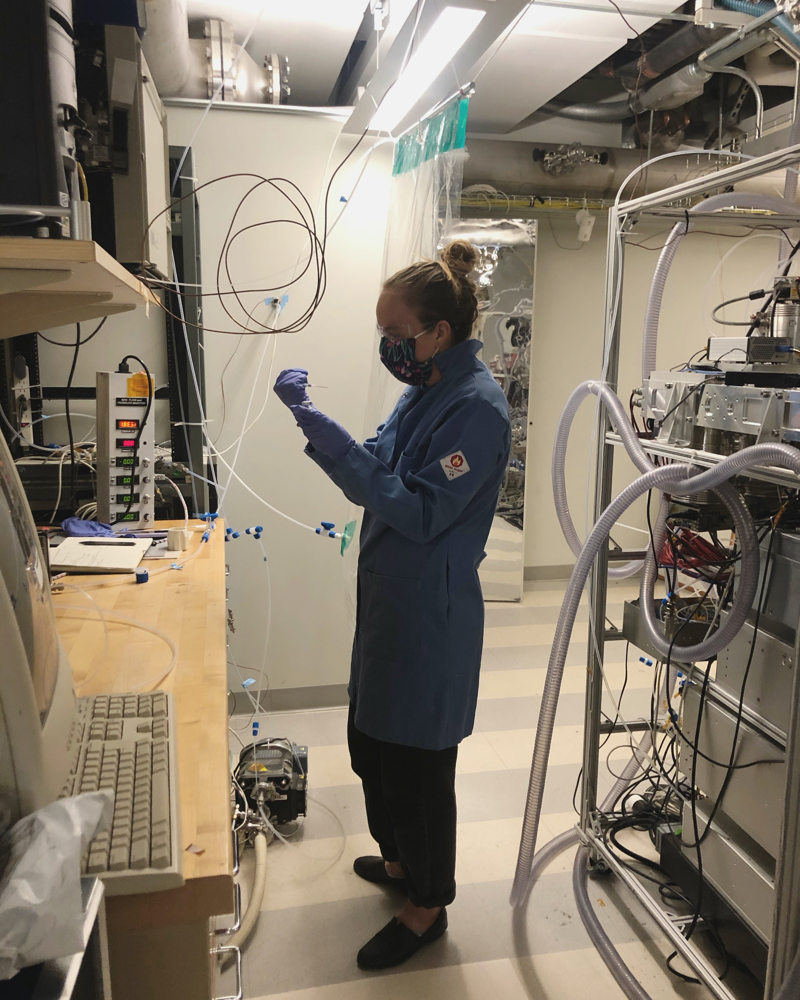
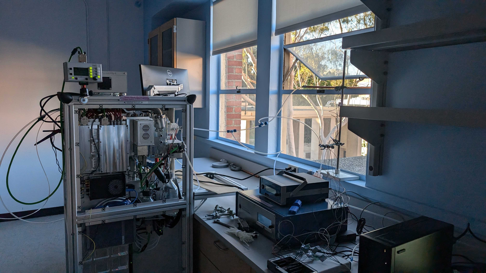
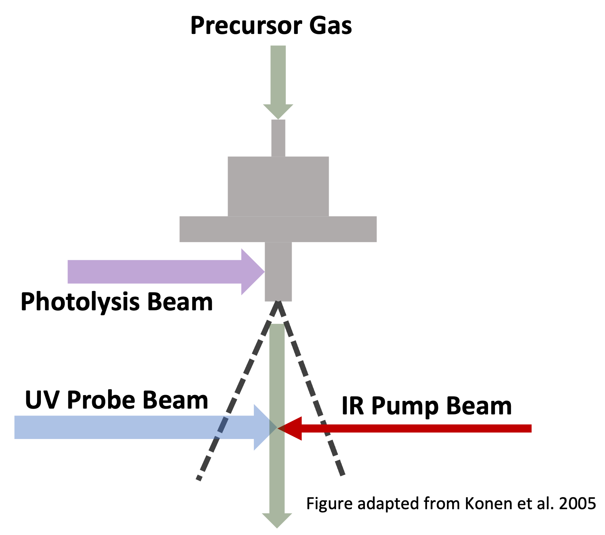

My research aims to elucidate the products and mechanisms of peroxy radical reactions in understudied chemical environments. I use a combination of physical and analytical approaches in the lab and the field to measure the kinetics of these reactions, identify products, and probe the impact of these reactions on regional atmospheric chemistry. 

## Laboratory Chamber Studies of Peroxy Radicals

### Formation of Accretion Products 
In this work, I aim to measure the kinetics of peroxy radical self-reactions, specifically the pathway to the formation of a peroxide accretion product (ROOR). Using gas chromatography and mass spectrometry, I aim to both quantify the formation of the ROOR and also identify these products by comparison against standards synthesized in the lab of [Brian Stoltz](https://www.stoltz.caltech.edu/brianstoltz) at Caltech. This work (see the publication [here](../publication/2023-accretionproductformationethene)) has focused on developing a method for the study of these reactions using ethene as a model system. I have also expanded this method to study more complex small alkenes and develop a better understanding for the structure-activity relationship of the formation of this product
### Product Distributions and Peroxy Radical Structure
As part of my postdoctoral research, I have worked to use NH$_4$$^+$ CIMS to examine the product distributions of high RO$_2$ systems, where self- and cross-reactions of RO$_2$ dominate, as a function of peroxy radical structure and functionalization. To achieve high concentrations of RO$_2$ and structural specificity, we have used the photolysis of commercial and synthesized organic iodine compounds as RO$_2$ sources. I aim to examine product distribution as a whole, with attention paid to products consistent with fragmentation, termination, and dimerization, to better understand the atmospheric impact of peroxy radicals as a function of structure. 

## Field Studies 

### Ambient Organic Nitrogen Chemistry
 In 2021, I participated in the Re-Evaluating the Chemistry of Air Pollutants in California ([RECAP-CA](https://csl.noaa.gov/projects/sunvex/)) field campaign, deploying the Caltech GC-CIMS in Pasadena to gain a better understanding of the air quality in Southern California. With this data, and comparison to light and dark oxidation experiments in the lab, we identified the major organic nitrate compounds in the Los Angeles urban atmosphere in the gas- and particle-phases (see the publication [here](../publication/2025-organicnitrogen)). The observations in this work ignited my curiosity in, among other topics, organic peroxy radical chemistry at night.

 
### Wildfires and Air Quality 
In January 2025, I deployed a proton transfer reaction mass spectrometer (PTR-MS) at UCLA to study the effect of the Los Angeles wildland-urban interface fires in the Palisades and Altadena. These data are providing valuable insights into the unique of effects of fires that burn both biogenic and synthetic fuel, and have further piqued my interest in studying the chemistry of organic compounds in unique chemical environments.
 
## Mechanistic Investigations of Peroxy Radical Reactions

An understanding of the mechanisms of bimolecular peroxy radical reactions is essential for predicting the importance of these reactions for a variety of precursors in the atmosphere. However, despite the importance of this mechanistic information, the mechanisms of many peroxy radical reactions are poorly understood or have not been experimentally confirmed. In this work, I am using IR action spectroscopy to detect reactive intermediates of peroxy radical reactions. This will allow us to better understand the mechanisms of these reactions and improve calculations of reaction energetics.

------------------------------------------------------------------------------- 
